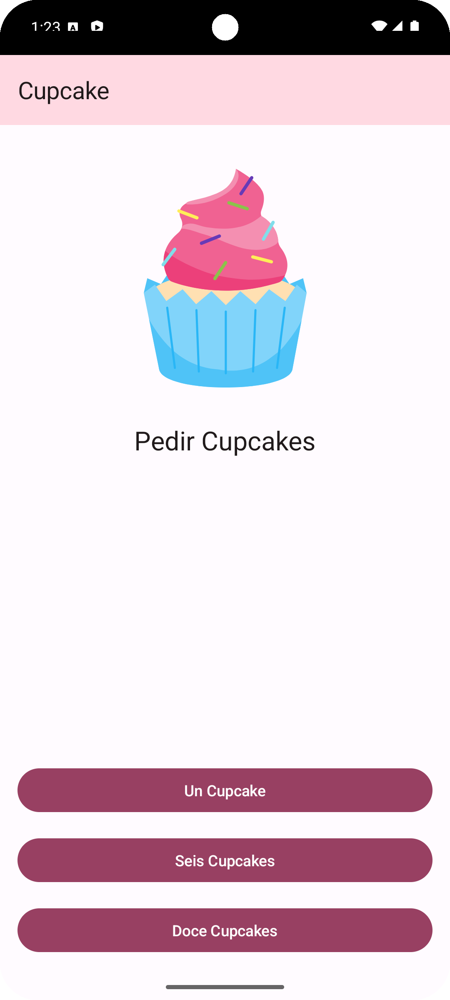

# Aplicación Cupcake - Ejemplo de Jetpack Compose

<!-- Badges (opcional, puedes generarlos en shields.io) -->
<!--  -->
<!--  -->
<!--  -->
<!--  -->

Esta aplicación de ejemplo demuestra un flujo de pedido de cupcakes, construida enteramente con Jetpack Compose y siguiendo las arquitecturas modernas de Android. Los usuarios pueden seleccionar la cantidad, el sabor y la fecha de recogida de sus cupcakes. Finalmente, se muestra un resumen del pedido que puede ser compartido a través de otras aplicaciones.

Este proyecto sirve como un excelente punto de partida para aprender y experimentar con Jetpack Compose y los componentes de Android Jetpack.

## Capturas de Pantalla



## Características

*   **Interfaz de Usuario Moderna:** Completamente construida con Jetpack Compose y Material 3.
*   **Navegación:** Utiliza Jetpack Navigation para moverse entre las diferentes pantallas de la aplicación.
*   **Gestión de Estado:** Implementa `ViewModel` para gestionar el estado de la UI y la lógica de negocio.
*   **Flujo de Pedido:**
    *   Selección de cantidad de cupcakes.
    *   Elección de sabor.
    *   Selección de fecha de recogida.
    *   Pantalla de resumen del pedido.
*   **Compartir Pedido:** Funcionalidad para compartir los detalles del pedido con otras aplicaciones (ej. email, mensajería).
*   **Diseño Responsivo (Básico):** Adaptado para diferentes tamaños de pantalla de móviles.

## Tecnologías Utilizadas

*   **Kotlin:** Lenguaje de programación principal.
*   **Jetpack Compose:** Para la construcción de la interfaz de usuario declarativa.
*   **Material 3:** Para los componentes visuales y el estilo.
*   **Android ViewModel:** Para la gestión del estado de la UI, consciente del ciclo de vida.
*   **Jetpack Navigation (Compose):** Para la navegación entre las diferentes pantallas (composables).
*   **Coroutines de Kotlin:** Para operaciones asíncronas.

## Pre-requisitos

Para compilar y ejecutar este proyecto, necesitarás:

*   Experiencia con la sintaxis de Kotlin.
*   Conocimiento básico sobre cómo crear y ejecutar proyectos en Android Studio.
*   Familiaridad con los conceptos fundamentales de Jetpack Compose (composables, estado, modificadores).
*   Android Studio Iguana (o una versión más reciente recomendada).

## Cómo Empezar

Sigue estos pasos para poner en marcha el proyecto:

1.  **Instalar Android Studio:** Asegúrate de tener la última versión estable de [Android Studio](https://developer.android.com/studio).
2.  **Clonar el Repositorio:**
    ```bash
    git clone https://github.com/rodrigoangeloni/ipdm-oto-2025--rodrigo_angeloni_cupcake.git
    # O descarga el ZIP del proyecto.
    ```
3.  **Importar en Android Studio:**
    *   Abre Android Studio.
    *   Selecciona "Open an Existing Project" (Abrir un proyecto existente).
    *   Navega hasta el directorio donde clonaste o descomprimiste el proyecto y selecciónalo.
4.  **Sincronizar Gradle:** Android Studio debería sincronizar automáticamente los archivos Gradle. Si no, haz clic en "Sync Project with Gradle Files" (Sincronizar proyecto con archivos Gradle).
5.  **Ejecutar la Aplicación:**
    *   Selecciona un emulador o conecta un dispositivo físico.
    *   Haz clic en el botón "Run 'app'" (Ejecutar 'app') (icono de reproducción verde).

## Estructura del Proyecto (Simplificada)

El proyecto sigue una estructura estándar de aplicación Android, con los componentes clave organizados de la siguiente manera:

*   `app/src/main/java/com/example/cupcake/`
    *   `data/`: Contiene las clases de datos (`OrderUiState`) y fuentes de datos (`DataSource`).
    *   `ui/`: Contiene los composables de las pantallas (`StartOrderScreen`, `SelectOptionScreen`, `OrderSummaryScreen`), el `OrderViewModel`, componentes de UI reutilizables (`CommonUi.kt`) y la lógica de navegación (`CupcakeScreen.kt`).
    *   `ui/theme/`: Define el tema de la aplicación (colores, tipografía).
    *   `MainActivity.kt`: El punto de entrada de la aplicación.
*   `app/src/main/res/`: Contiene recursos como strings, drawables y dimens.

## Contribuciones

Las contribuciones son bienvenidas. Por favor, consulta `CONTRIBUTING.md` para más detalles sobre cómo puedes ayudar.

## Licencia

Este proyecto está licenciado bajo los términos del archivo `LICENSE` (Apache License 2.0).
